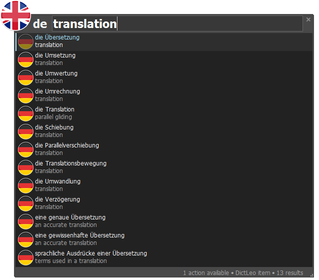

Keypirinha Plugin: Leo Dictionary
=========

Searches the German Leo dictionary ([http://dict.leo.org](http://dict.leo.org "http://dict.leo.org")) for the languages English, French, Spanish, Italian, Chinese, Russian, Portuguese and Polish. Feeds back the results into Keypirinha for instantly seeing the translated word. When hitting 'Enter' the translated word is copied to the clipboard.

There are multiple ways to search Leo:

* de - Translating a German word to English and vice versa.
* df - Translating a German word to French and vice versa.
* ds - Translating a German word to Spanish and vice versa.
* di - Translating a German word to Italian and vice versa.
* dr - Translating a German word to Russian and vice versa.
* db - Translating a German word to Portuguese and vice versa.
* dp - Translating a German word to Polish and vice versa.

## Release Notes: ##

V 1.0:
First release of plugin.
